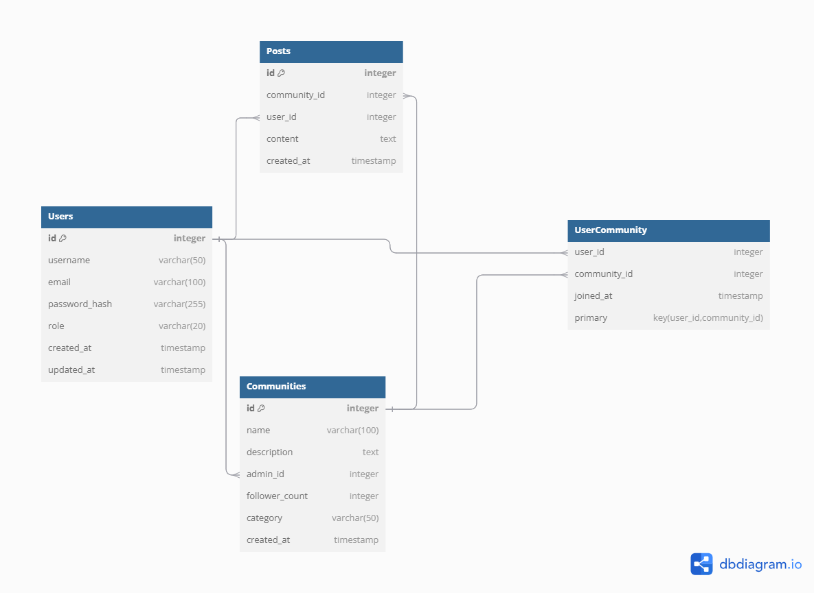

# Entity Relationship Diagram

Reference the Creating an Entity Relationship Diagram final project guide in the course portal for more information about how to complete this deliverable.

## Create the List of Tables

1. **Users Table**
   - Stores user information and authentication details.
   - **Columns:**
     - `id` **(PK)**: `INTEGER` - Unique identifier for each user.
     - `username`: `VARCHAR(50)` - Username chosen by the user.
     - `email`: `VARCHAR(100)` - User’s email, used for login (unique).
     - `password_hash`: `VARCHAR(255)` - Hashed password for secure authentication.
     - `role`: `VARCHAR(20)` - User’s role (e.g., `"user"` or `"admin"`). Default is `"user"`.
     - `created_at`: `TIMESTAMP` - Timestamp for when the account was created.
     - `updated_at`: `TIMESTAMP` - Timestamp for the last time the account was updated.
   - **Relationships:** One-to-Many with Communities (admin of a community), Many-to-Many with Communities (as a member).

2. **Communities Table**
   - Stores information about each community.
   - **Columns:**
     - `id` **(PK)**: `INTEGER` - Unique identifier for each community.
     - `name`: `VARCHAR(100)` - Name of the community.
     - `description`: `TEXT` - Description of the community.
     - `category`: `VARCHAR(50)` - Category (e.g., "Tech", "Sports").
     - `admin_id` **(FK)**: `INTEGER` - References `users(id)`, indicating the user who created and manages the community.
     - `follower_count`: `INTEGER` - Count of users who have joined the community.
     - `created_at`: `TIMESTAMP` - Timestamp for when the community was created.
   - **Relationships:** One-to-Many with Posts, Many-to-Many with Users (followers/members), One-to-Many with Users (for admin role).

3. **Posts Table**
   - Stores posts created within communities.
   - **Columns:**
     - `id` **(PK)**: `INTEGER` - Unique identifier for each post.
     - `community_id` **(FK)**: `INTEGER` - References `communities(id)`, indicating the community where the post was created.
     - `user_id` **(FK)**: `INTEGER` - References `users(id)`, indicating the user who created the post.
     - `content`: `TEXT` - Content of the post.
     - `created_at`: `TIMESTAMP` - Timestamp for when the post was created.
   - **Relationships:** Many-to-One with Communities (each post belongs to one community), Many-to-One with Users (each post has one author).

4. **UserCommunity Table (Join Table)**
   - Manages the many-to-many relationship between Users and Communities, tracking which users have joined which communities.
   - **Columns:**
     - `user_id` **(FK)**: `INTEGER` - References `users(id)`, indicating the user who joined the community.
     - `community_id` **(FK)**: `INTEGER` - References `communities(id)`, indicating the community the user joined.
     - `joined_at`: `TIMESTAMP` - Timestamp for when the user joined the community.
   - **Relationships:** Many-to-Many between Users and Communities.

### **Relationships Overview**

- **One-to-Many:**
  - **Users** to **Communities**: A user (acting as admin) can create and manage multiple communities.
  - **Communities** to **Posts**: A community can contain multiple posts.
  - **Users** to **Posts**: Each user can create multiple posts.

- **Many-to-Many (via `UserCommunity` join table):**
  - **Users and Communities**: Users can join multiple communities, and each community can have multiple members (users).

## Add the Entity Relationship Diagram

### ER Diagram Summary

- **Users** → **Communities**: One-to-Many (`admin_id` in `Communities` table).
- **Users** ↔ **Communities**: Many-to-Many (`UserCommunity` table).
- **Communities** → **Posts**: One-to-Many (`community_id` in `Posts` table).
- **Users** → **Posts**: One-to-Many (`user_id` in `Posts` table).

