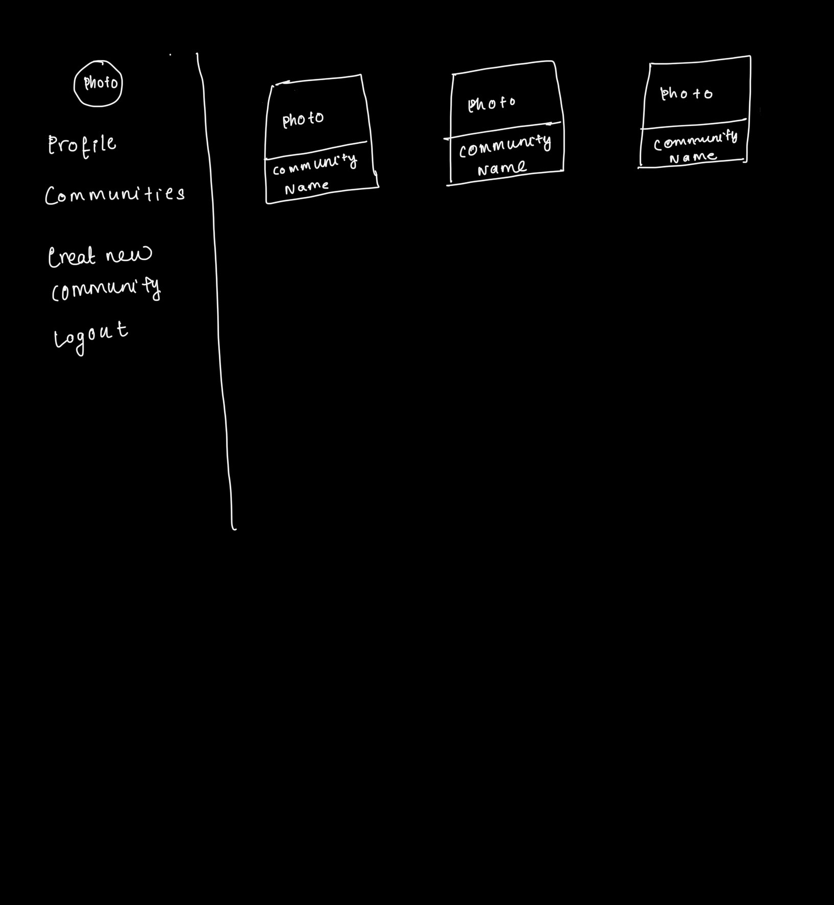
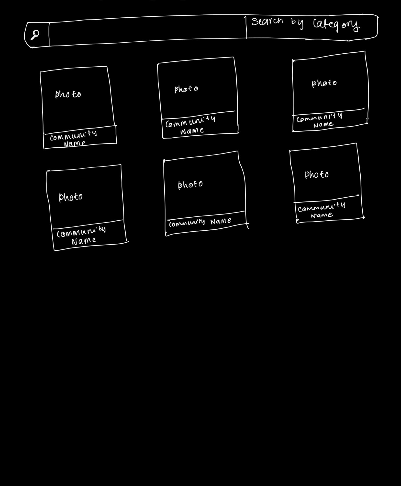
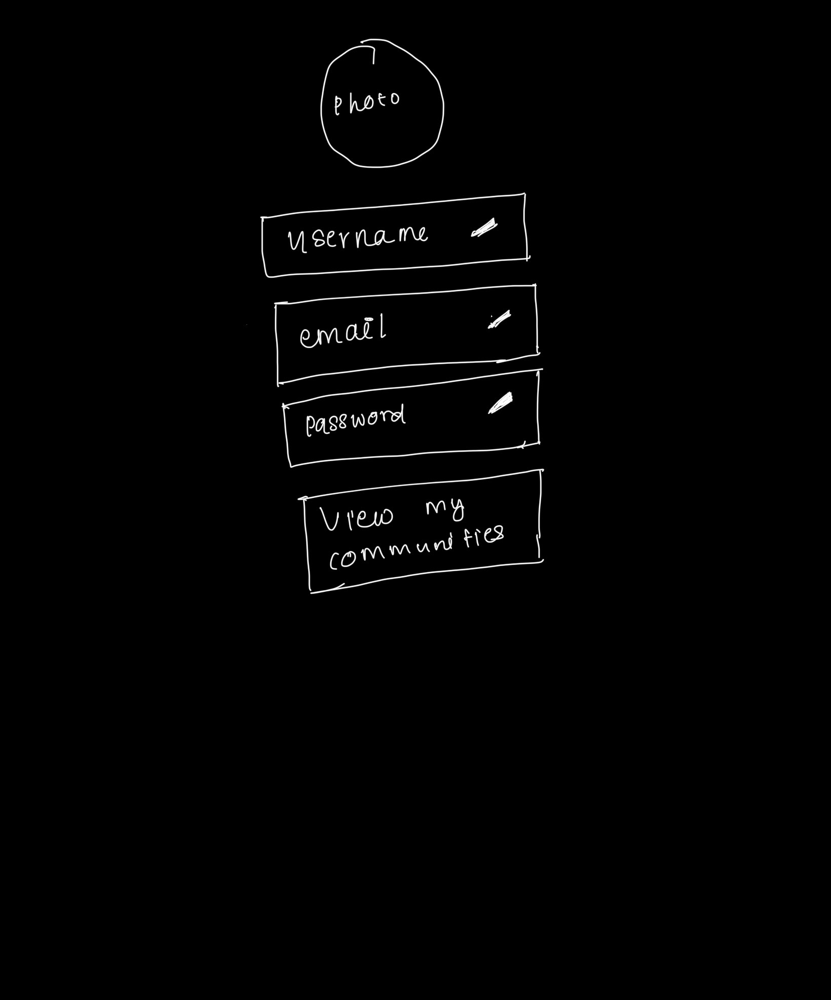

# Wireframes

Reference the Creating an Entity Relationship Diagram final project guide in the course portal for more information about how to complete this deliverable.

## List of Pages
    1. SignUp Page(/signup)
    2. Login Page(/login)
    3. Home Page(/) ⭐
    4. Community Listing Page(/communities) ⭐
    5. Community Details Page (/communities/:id)
    6. Post Details Page (/communities/:communityId/posts/:postId)
    7. User Profile Page (/users/:id/profile) ⭐
    8.  Create or Edit Community Page (/communities/create or /communities/:id/edit)
    9. Create or Edit Post Page (/communities/:communityId/posts/create or /communities/:communityId/posts/:postId/edit)
    10.  Error Page (/error)
    11. User Communities Page(/users/:id/mycommunities)
    

## Wireframe 1: [Home Page]

## Wireframe 2: [Community Listing Page]

## Wireframe 3: [User Profile Page]

